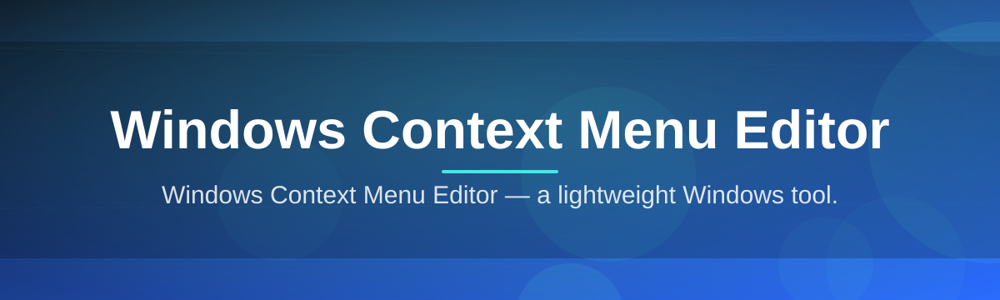

# Windows-Context-Menu-Editor-2151

Windows Context Menu Editor — a lightweight Windows tool.

  

## Overview

Windows Context Menu Editor — a lightweight Windows tool.

## License

[MIT License](LICENSE)
